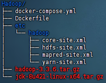
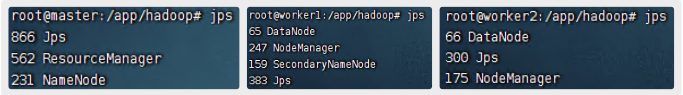
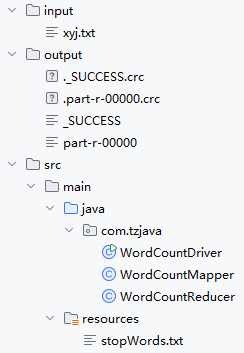
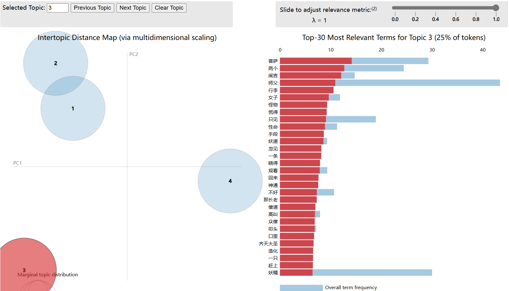
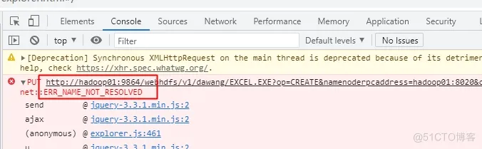
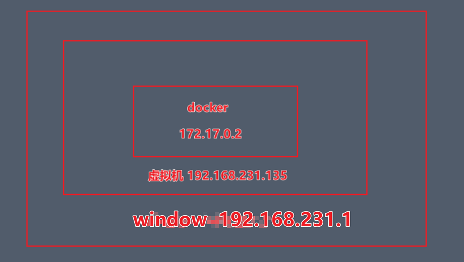

# NCST-DS-HADOOP
2024云计算课程作业

1. 在自己的笔记本/云服务器等设备上部署Hadoop，HDFS,Mapreduce等相关组件
2. 对Hadoop系统上传一部小说，利用MapReduce生成词云分析，生成小说主题，隐去敏感信息例如小说的作者，名字等

# 0 - 部署Hadoop

- `0-docker-hadoop` 目录中不含hadoop与jdk安装包，需自行下载并放到如下图所示位置

  

  - 需保证文件名与上图一致，或自行修改Dockerfile

  - java8和hadoop配置文件准备好后，从Dockerfile开始构建hadoop基础镜像
    `docker build -t hadoop .`

  - 执行docker-compose启动3个容器
    `docker-compose up -d`

  - 启动hadoop集群和测试验证
    使用 `docker ps` 查看master容器的名字(假设为hadoop-master)

    1. 进入master容器
       `docker exec -it hadoop-master bash`

    2. 格式化HDFS
       `hdfs namenode -format`

    3. 启动hadoop集群
       `start-all.sh`

    4. 查看各个容器的进程(`jps`)

       

# 1 - WordCount

## Jieba中文分词

- 命令行运行以下代码
  `python -m jieba -d xs.txt > cut_result.txt`
  - `xs.txt` 为待分词的小说
  - `cut_result.txt` 为分词结果

## MapReduce

- Maven项目结构如下图所示

- Jar文件运行方式
  `hadoop jar /path/to/WordCount.jar com.tzjava.WordCountDriver /input /output`
  - `/path/to/WordCount.jar` 是linux路径
  - `com.tzjava.WordCountDriver` 指定运行类名
  - `/input /output` 是HDFS上的输入输出路径
- 结果如下

## 词云图

- 将词频结果与 `WordCloud.R` 脚本放于同一级目录下，直接运行

# 2 - 生成主题

- 使用pycharm打开工程，等待扫描依赖库完成，点击运行即可测试。
- 如果要进行最优主题选取，需要将注释的代码删除注释，才可进行。
- 在运行完最优主题选取后，即可把注释恢复，代码会更快地加载完毕。
- 同时注意在保存最优主题数时需要手动输入，否则代码将进入暂停状态，不会继续运行。

# 可能出现的问题

> 1. hdfs 的web界面上传文件时报错 :Couldn't upload the file data.txt

> 如图所示，win10的hosts没有配置ip映射,无法解析域名hadoop01，或者即使配置了hosts但也无法连通。添加路由后即可解决
>
> 2. IDEA中的big data tools无法加载出hdfs文件，原因同上

- 解决方式：设置路由

  - docker默认使用的是bridge网络，有nat转换，比如下图这种

    

  - 此时，虚拟机可以Ping通docker，但windows无法ping通docker，需要在windows中添加路由 `ROUTE add 172.17.0.0 mask 255.255.0.0 192.168.231.135`

  - 并关闭虚拟机防火墙，或者设置防火墙允许传入和转发

  - 最后在windows的hosts中配置ip映射
